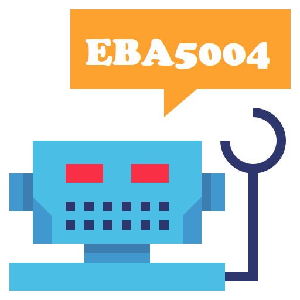

[![Contributors][contributors-shield]][contributors-url]
[![Forks][forks-shield]][forks-url]
[![Stargazers][stars-shield]][stars-url]
[![Issues][issues-shield]][issues-url]
[![MIT License][license-shield]][license-url]
[![LinkedIn][linkedin-shield]][linkedin-url]

<!-- PROJECT LOGO -->
<br />
<p align="center">
  <a href="https://github.com/eleow/shopBot">
    
  </a>

  <h3 align="center">AudioPhil, the shopbot for headphones</h3>

  <p align="center">
    Quickly get product recommendations and product information for headphones by just typing into a chat interface
    <br />
    <br />
    <br />
    <a href="">View Demo</a>
    ·
    <a href="https://github.com/eleow/shopBot/issues">Report Bug</a>
    ·
    <a href="https://github.com/eleow/shopBot/issues">Request Feature</a>
  </p>
</p>

## About

This was the group project by <a href="https://github.com/eleow">Edmund</a>, <a href="https://github.com/gitacct1800">Meiying</a>, <a href="https://github.com/Shashankwer">Shashank</a>, and <a href="https://github.com/Quinceyyy">Wenqi</a> (listed in alphabetical order), for

* Graduate Certificate in [Practical Language Processing](https://www.iss.nus.edu.sg/stackable-certificate-programmes/business-analytics/graduate-certificate-in-practical-language-processing") offered by [NUS-ISS](https://www.iss.nus.edu.sg "Institute of Systems Science, National University of Singapore").

The objective of the chatbot is to give users better "decision simplicity" in their shopping for headphones, utilising Google DialogFlow, rasa NLU, Kommunicate, and other NLP techniques and libraries. As a demo, the deployed chatbot would be embedded within a (fake) electronics website.


## Getting Started

### Installation

* Clone this repo:

```sh
git clone https://github.com/eleow/shopBot.git
```

* Refer to [User Guide](https://github.com/eleow/shopBot/blob/master/docs/User%20Guide.docx)

## Usage


The following intents are available

* Get product recommendations
* Get answers to headphone-related stuff (FAQ)
* Get pricing information for a specific headphone model

### Get product recommendations

TODO

### Get answers to FAQ on headphone-related stuff

When the user has a query on a specific term, we will try the following in order

* Exact word or synonym matching of query with terms in database,
* Similarity matching of query with terms in database, based on word vectors using [spacy model 'en_core_web_md'](https://spacy.io/models/en#en_core_web_md) (English multi-task CNN trained on OntoNotes, with GloVe vectors trained on Common Crawl)


### Get product pricing and information

When the user wants to find out about a specific model, we will check our preprocessed list of brands and models from Amazon and Treoo, and return the most suitable match. If the item exists in both Amazon and Treoo, the lower priced item would be shown.

## Unit Testing

Intents and entities recognition can be tested via [dialogflow_testing.py](https://github.com/eleow/shopBot/blob/master/SystemCode/DialogFlow/unit_testing/dialogflow_testing.py). Simply run it and pass in the path to the configuration file (eg config.ini), like so

```bash
python dialogflow_test.py --config "./config.ini"
```

The configuration file should contain the following:

* CREDENTIALS - path to the DialogFlow JSON file, relative to script
* TEST_FILE - path to file containing test cases, relative to script


For more details, including how to specify intent confidence threshold, etc, use the following:

```bash
python dialogflow_test.py --help
```


[A sample configuration file](https://github.com/eleow/shopBot/blob/master/SystemCode/DialogFlow/unit_testing/config.ini.sample) is provided in the repository.

The script will loop through all test cases in TEST_FILE, verifying it against expected intent and expected entities by sending it to the DialogFlow backend specified in CREDENTIALS, to give a summary of the number of passed test cases.

## License

Distributed under the [MIT License](LICENSE)

## Acknowledgements


Shop assistant icon modified from graphic by <a href="https://www.flaticon.com/authors/freepik" title="Freepik">Freepik</a> from <a href="https://www.flaticon.com/" title="Flaticon"> www.flaticon.com</a>


<!-- MARKDOWN LINKS & IMAGES -->
<!-- https://www.markdownguide.org/basic-syntax/#reference-style-links -->
[contributors-shield]: https://img.shields.io/github/contributors/eleow/shopBot
[contributors-url]: https://github.com/eleow/shopBot/graphs/contributors
[forks-shield]: https://img.shields.io/github/forks/eleow/shopBot
[forks-url]: https://github.com/eleow/shopBot/network/members
[stars-shield]: https://img.shields.io/github/stars/eleow/shopBot
[stars-url]: https://github.com/eleow/shopBot/stargazers
[issues-shield]: https://img.shields.io/github/issues/eleow/shopBot
[issues-url]: https://github.com/eleow/shopBot/issues
[license-shield]: https://img.shields.io/github/license/eleow/shopBot
[license-url]: https://github.com/eleow/shopBot/blob/master/LICENSE
[linkedin-shield]: https://img.shields.io/badge/-LinkedIn-black.svg?style=flat-square&logo=linkedin&colorB=555
[linkedin-url]: https://linkedin.com/in/edmundleow
[product-screenshot]: images/screenshot.png

